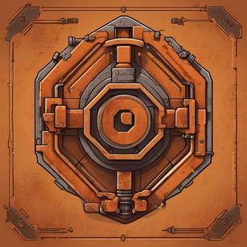

<p align="center" width="100%">
  
</p>

# CommitCraft

CommitCraft is a command-line interface (CLI) tool that generates commit messages for stashed changes in two formats: generic and conventional commit. It leverages the power of OpenAI to create meaningful and descriptive commit messages.

## Features

- Generates commit messages for stashed changes
- Supports two formats: generic and conventional commit
- Utilizes OpenAI for intelligent commit message generation
- Allows adding a summarized description to the commit body

## Installation

You can install CommitCraft using Homebrew:

```
brew install leventekk/commitcraft
```

## Usage

### Generating Commit Messages

To generate a commit message, use the `generate` command:

```
commitcraft generate
```

By default, it generates a commit message in the conventional commit format. You can specify the format using the `-f` or `--format` flag:

```
commitcraft generate -f raw
```

To include a summarized description in the commit body, use the `-d` or `--description` flag:

```
commitcraft generate -d
```

### Configuring API Key

To set the OpenAI API key, use the `config` command with the `--api-key` flag:

```
commitcraft config --api-key YOUR_API_KEY
```

Replace `YOUR_API_KEY` with your actual OpenAI API key.

## License

CommitCraft is released under the [MIT License](https://opensource.org/licenses/MIT).
